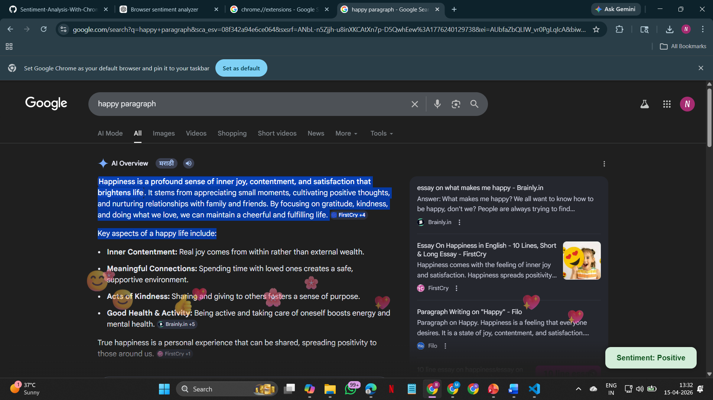
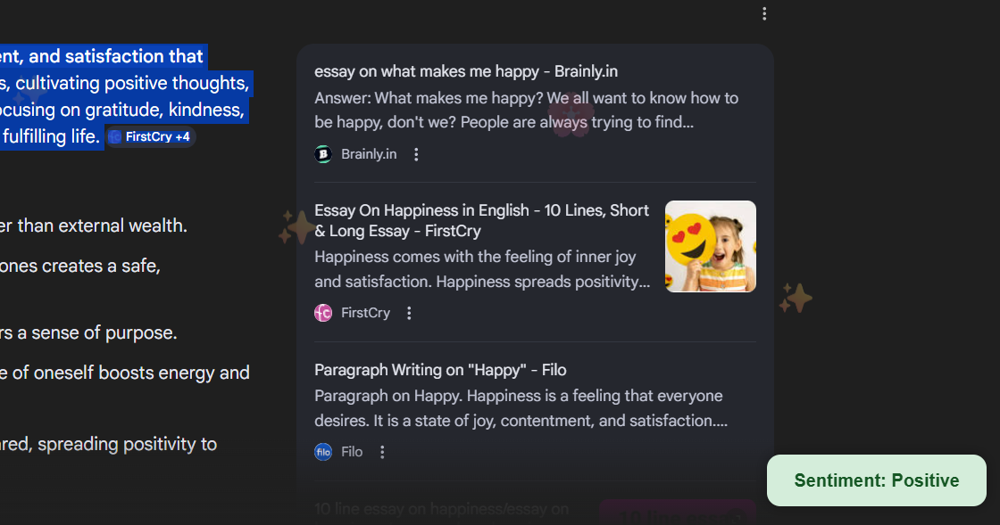

# 🌐 Real-Time Sentiment Analysis using Chrome Extension

A full-stack AI project that integrates a Chrome Extension with a Django-based ML model to perform real-time sentiment analysis on selected text from any webpage.

## 🚀 Features
- Analyze sentiment directly on any website
- Works on selected text or comments
- Real-time popup display (Positive / Negative / Neutral)
- Integrated with Django ML backend
- Fast and lightweight Chrome Extension

## 🛠️ Tech Stack
- Frontend: HTML, CSS, JavaScript (Chrome Extension)
- Backend: Django (Python)
- Machine Learning: Scikit-learn / NLP
- API: REST API (JSON)

  ## 📸 Output Screenshots

### 🔹 Text Selection

### 🔹 Sentiment Popup

